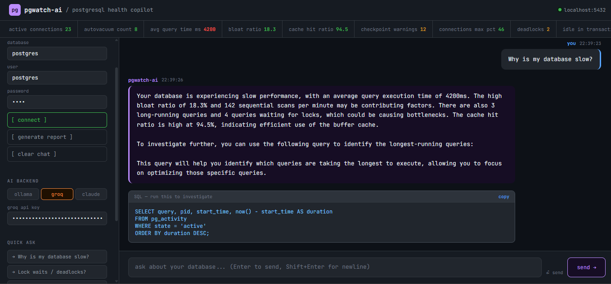
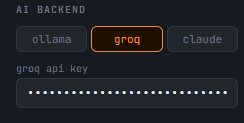
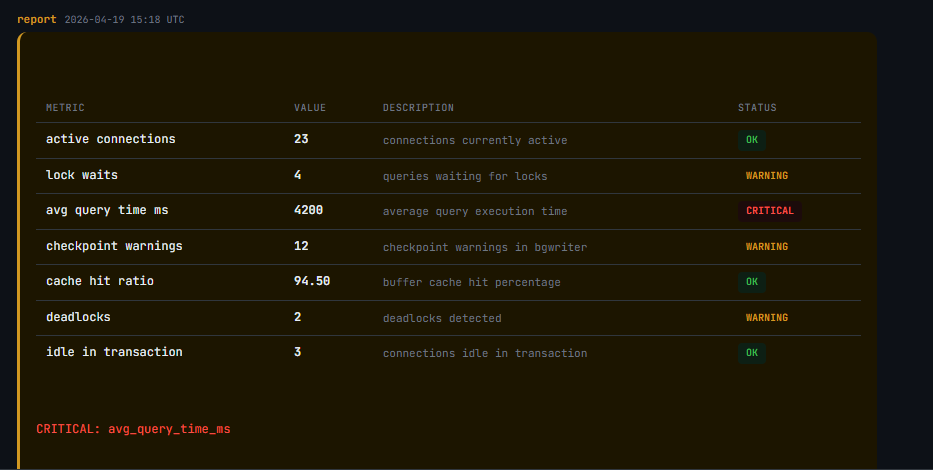
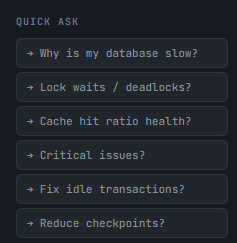
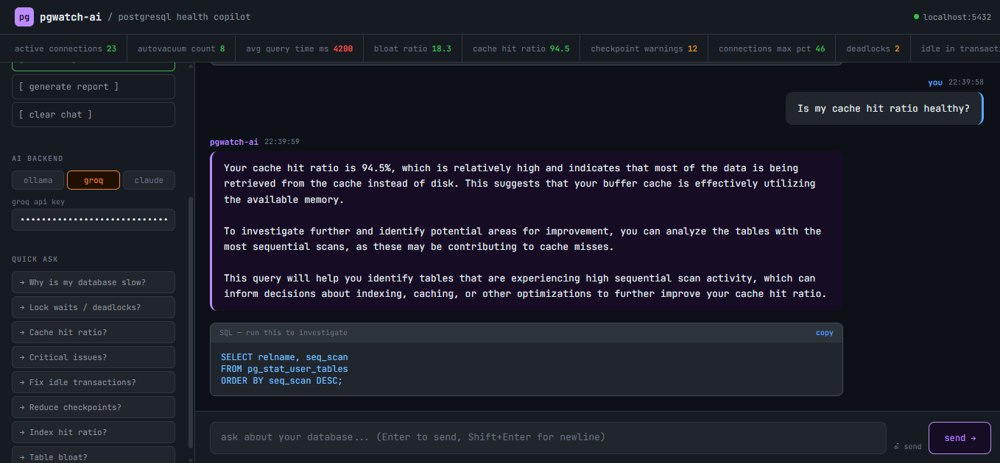
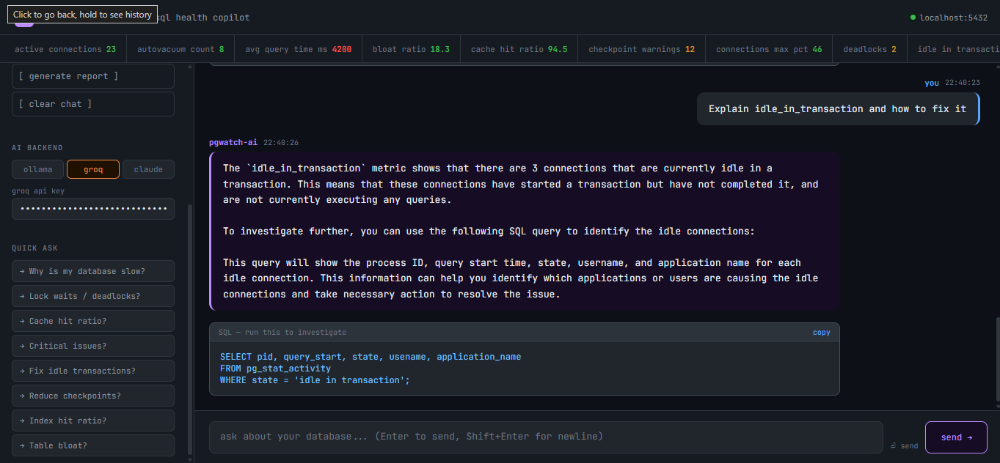

# pgwatch-ai 🐘

> **AI-powered PostgreSQL health monitoring copilot** — ask your database what's wrong, in plain English.


---

## What is pgwatch-ai?

pgwatch-ai is a chat-based web application that lets you diagnose PostgreSQL database health using natural language. Instead of manually writing complex SQL queries against `pg_stat_activity`, `pg_locks`, and other system views, you simply ask:

> *"Why is my database slow?"*
> *"Are there any deadlocks?"*
> *"Is my cache hit ratio healthy?"*

The AI analyzes your **real-time database metrics** and responds with a diagnosis + a concrete SQL query to investigate further.

---

## Screenshots

### Main Chat Interface


### API models


### Health Report


### Quick Ask Buttons


### Cache Hit Ratio Analysis


### Idle Transaction Explanation


---

## Features

- **Natural language queries** — ask anything about your PostgreSQL health
- **Live metrics bar** — real-time display of 15 key database metrics
- **AI diagnosis** — powered by Groq (LLaMA 3.3 70B), Ollama (local), or Claude (Anthropic)
- **SQL suggestions** — every AI response includes a runnable SQL query
- **Health report** — one-click report with OK / WARNING / CRITICAL status per metric
- **Quick Ask buttons** — 8 pre-built common diagnostic questions
- **Dark terminal UI** — clean, readable interface built for developers
- **Multi-LLM support** — switch between Groq, Ollama, and Claude from the sidebar

---

## Metrics Monitored

| Metric | Description | Threshold |
|--------|-------------|-----------|
| `active_connections` | Currently active connections | — |
| `avg_query_time_ms` | Average query execution time | > 1000ms = CRITICAL |
| `lock_waits` | Queries waiting for locks | > 2 = WARNING |
| `deadlocks` | Deadlocks detected | > 0 = WARNING |
| `cache_hit_ratio` | Buffer cache hit percentage | < 90% = CRITICAL |
| `checkpoint_warnings` | Checkpoint warnings in bgwriter | > 5 = WARNING |
| `idle_in_transaction` | Connections idle in transaction | — |
| `bloat_ratio` | Table bloat percentage | > 20% = WARNING |
| `replication_lag_mb` | Replication lag in megabytes | — |
| `temp_files_created` | Temporary files created per hour | — |
| `autovacuum_count` | Autovacuum runs in last hour | — |
| `long_running_queries` | Queries running > 5 minutes | > 0 = WARNING |
| `index_hit_ratio` | Index cache hit percentage | — |
| `seq_scans_per_min` | Sequential scans per minute | — |
| `connections_max_pct` | % of max_connections used | — |

---

## Tech Stack

```
Browser (HTML/CSS/JS)
      ↓
Flask (Python backend)
      ├── psycopg2      → PostgreSQL
      ├── Groq API      → LLaMA 3.3 70B (recommended)
      ├── Ollama        → local LLM (offline)
      └── Anthropic API → Claude Haiku
```

---

## Project Structure

```
pgwatch-ai/
├── pgwatch.py          ← Flask backend (all API routes + LLM logic)
├── requirements.txt    ← Python dependencies
├── templates/
│   └── index.html      ← Full chat UI (single file, no framework)
└── README.md
```

---

## Quick Start

### 1. Clone the repo

```bash
git clone https://github.com/piuushhh-07/pgwatch-ai.git
cd pgwatch-ai
```

### 2. Install dependencies

```bash
pip install -r requirements.txt
```

### 3. Set up the database

Run this in pgAdmin or psql to create the metrics table with demo data:

```sql
CREATE TABLE IF NOT EXISTS pgwatch_metrics (
    id SERIAL PRIMARY KEY,
    time TIMESTAMP DEFAULT NOW(),
    metric_name TEXT UNIQUE,
    metric_value FLOAT,
    details TEXT
);

INSERT INTO pgwatch_metrics (metric_name, metric_value, details) VALUES
    ('active_connections',   23,   'connections currently active'),
    ('lock_waits',           4,    'queries waiting for locks'),
    ('avg_query_time_ms',    4200, 'average query execution time'),
    ('checkpoint_warnings',  12,   'checkpoint warnings in bgwriter'),
    ('cache_hit_ratio',      94.5, 'buffer cache hit percentage'),
    ('deadlocks',            2,    'deadlocks detected'),
    ('idle_in_transaction',  3,    'connections idle in transaction'),
    ('bloat_ratio',          18.3, 'table bloat percentage'),
    ('replication_lag_mb',   0.5,  'replication lag in megabytes'),
    ('temp_files_created',   47,   'temporary files created per hour'),
    ('autovacuum_count',     8,    'autovacuum runs in last hour'),
    ('long_running_queries', 3,    'queries running more than 5 minutes'),
    ('index_hit_ratio',      98.2, 'index cache hit percentage'),
    ('seq_scans_per_min',    142,  'sequential scans per minute'),
    ('connections_max_pct',  46,   'percentage of max_connections used')
ON CONFLICT (metric_name) DO UPDATE
    SET metric_value = EXCLUDED.metric_value,
        details = EXCLUDED.details,
        time = NOW();
```

### 4. Run the server

```bash
python pgwatch.py
```

### 5. Open in browser

```
http://localhost:5000
```

---

## AI Backend Setup

### Option A — Groq (Recommended, Free)

1. Sign up at [console.groq.com](https://console.groq.com)
2. Go to **API Keys** → **Create Key**
3. Copy your `gsk_...` key
4. In the web app: click **groq** toggle → paste your key

Uses `llama-3.3-70b-versatile` — fast, free, and accurate.

### Option B — Ollama (Local, Offline)

```bash
# Install Ollama from https://ollama.com
ollama serve
ollama pull llama3
```

Select **ollama** toggle in the app — no API key needed.

### Option C — Claude (Anthropic)

1. Get API key from [console.anthropic.com](https://console.anthropic.com)
2. Select **claude** toggle → paste your `sk-ant-...` key

Uses `claude-haiku` model.

---

## API Endpoints

| Method | Endpoint | Description |
|--------|----------|-------------|
| `GET` | `/` | Web UI |
| `POST` | `/api/connect` | Connect to DB and fetch metrics |
| `POST` | `/api/ask` | Ask AI a question |
| `POST` | `/api/report` | Generate health report |
| `POST` | `/api/metrics` | Refresh metrics |

### Example — `/api/ask`

```json
POST /api/ask
{
  "question": "Why is my database slow?",
  "metrics": { ... },
  "llm": "groq",
  "api_key": "gsk_..."
}
```

---

## How It Works

```
1. Connect → psycopg2 fetches metrics from pgwatch_metrics table
2. Ask     → metrics + question → build_prompt() → LLM API
3. Parse   → extract SQL from response → display in chat
4. Report  → evaluate thresholds → OK / WARNING / CRITICAL
```

The prompt engineering follows the same logic as the original CLI `pgwatch_ai.py`:

```python
def build_prompt(question, metrics):
    # Injects real metric values into context
    # Instructs AI to give diagnosis + one SQL query
    # Keeps response under 200 words
```

---

## CLI Version

The original CLI version (`pgwatch_ai.py`) is also included. It uses Ollama locally:

```bash
# Ask a question
python pgwatch_ai.py ask "Why is my database slow?"

# Generate report
python pgwatch_ai.py report

# Dry run (see prompt without calling LLM)
python pgwatch_ai.py ask "why is my db slow" --dry-run
```

---

## Contributing

Pull requests are welcome! Some ideas for contribution:

- Add real-time metric polling (auto-refresh every N seconds)
- Export report as PDF
- Add more pg system views as metric sources
- Docker support
- Authentication layer

---

## License

MIT License — see [LICENSE](LICENSE) for details.

---

## Author

**Piyush** — [@piuushhh-07](https://github.com/piuushhh-07)

---

*Built with Flask, psycopg2, Groq API, and a lot of PostgreSQL curiosity.*
